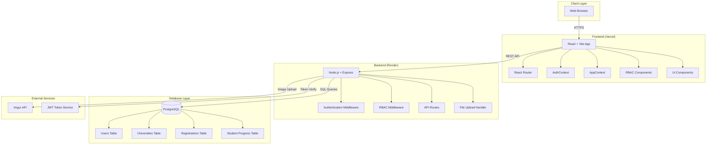
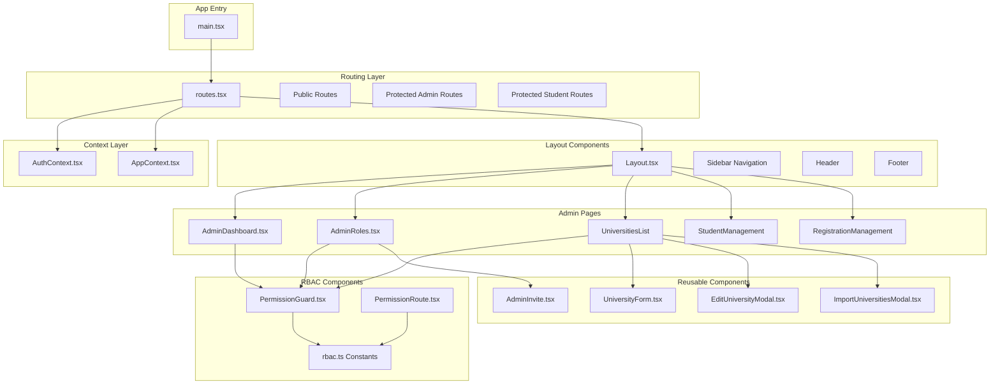
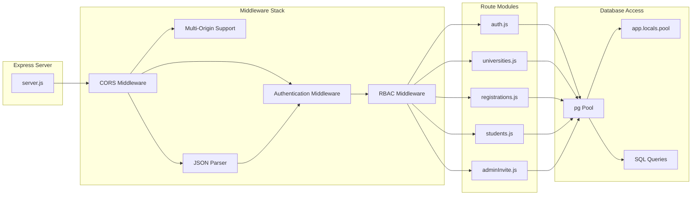
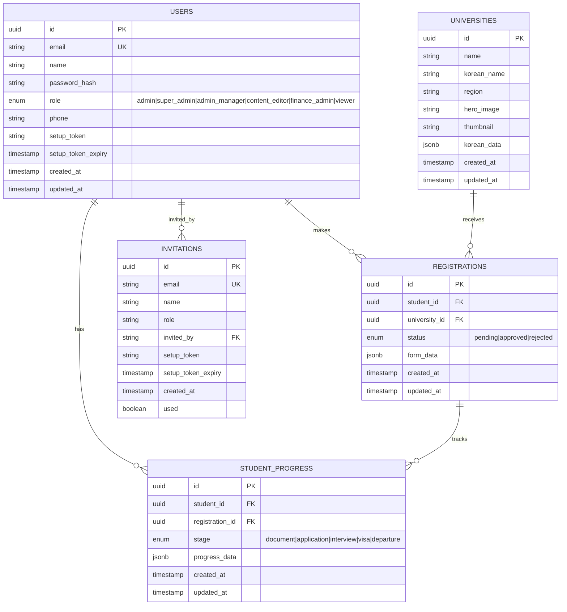
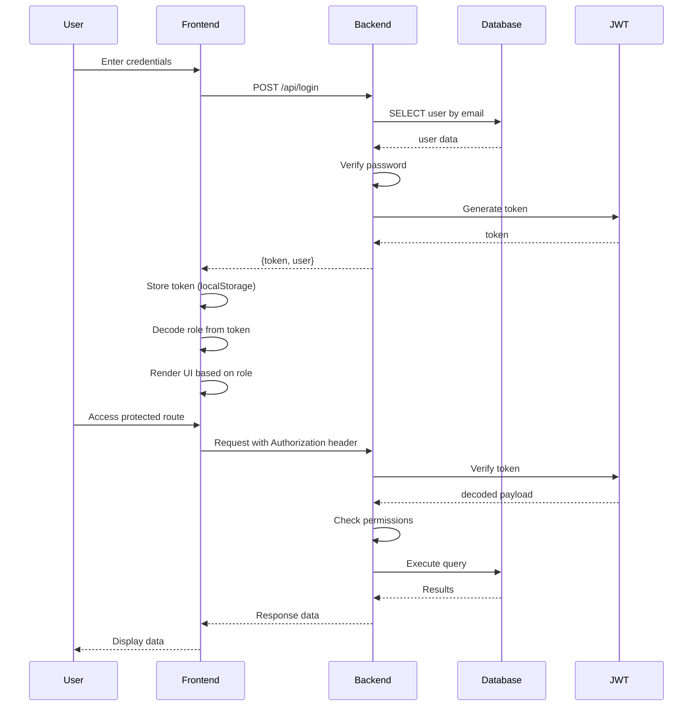
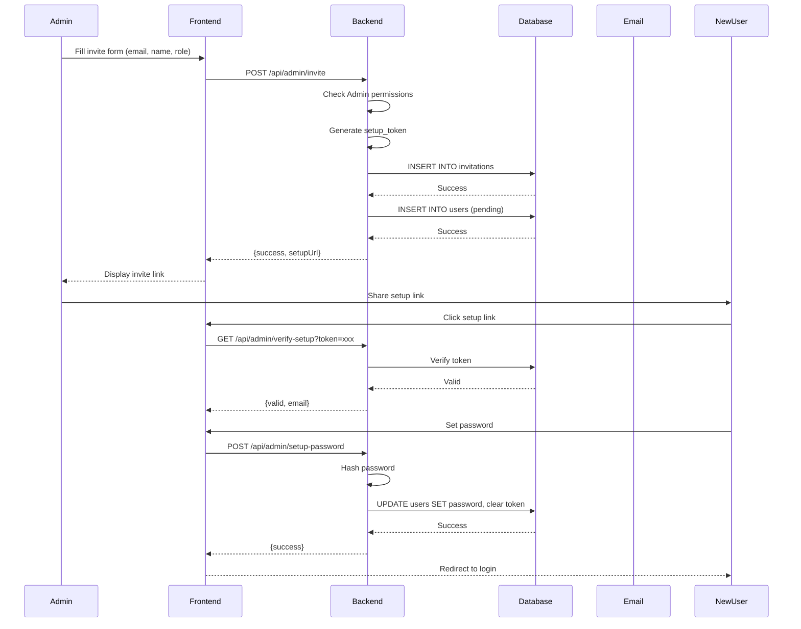
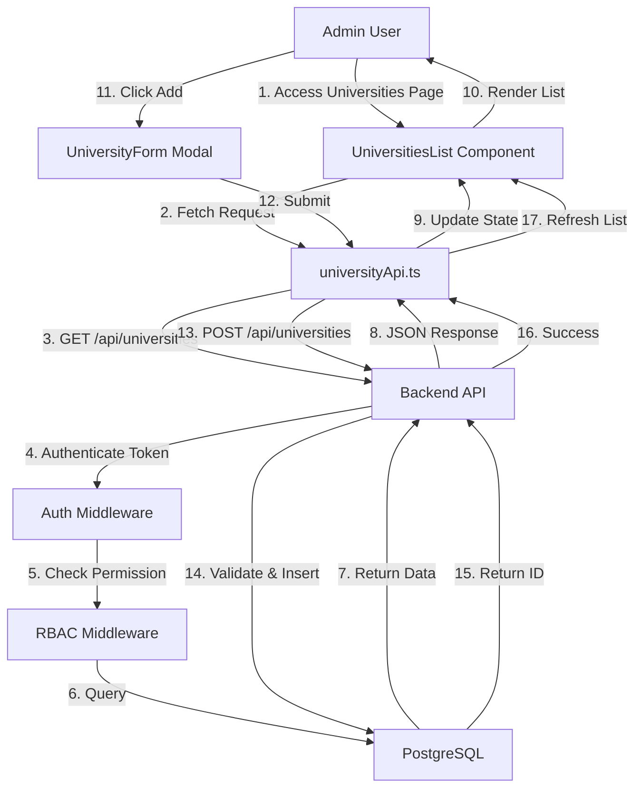
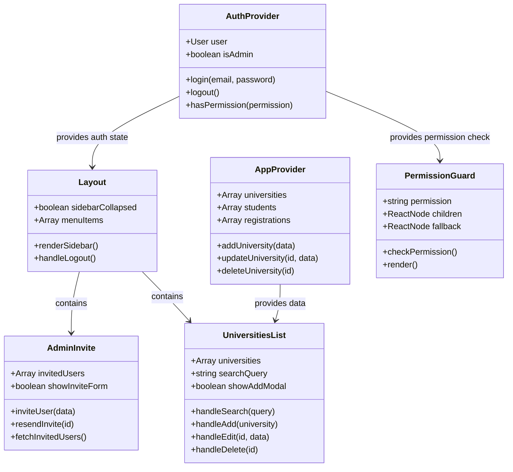
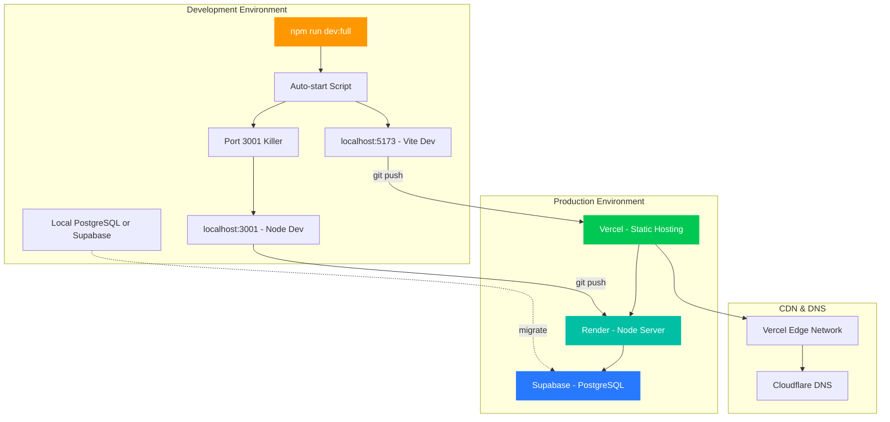

# Du Học Cost - System Architecture UML

## 1. System Architecture Overview



## 2. Frontend Component Architecture



## 3. Backend API Architecture



## 4. Database Schema (ER Diagram)



## 5. RBAC Permission Structure

```mermaid
graph TB
    subgraph "Roles Hierarchy"
        A[super_admin] -->|inherits| B[admin]
        B --> C[admin_manager]
        B --> D[content_editor]
        B --> E[finance_admin]
        B --> F[viewer]
    end

    subgraph "super_admin / admin Permissions"
        SA1[*]
    end

    subgraph "admin_manager Permissions"
        AM1[university:view]
        AM2[student:view/edit/progress]
        AM3[application:view/manage]
        AM4[payment:view]
        AM5[analytics:view]
    end

    subgraph "content_editor Permissions"
        CE1[university:view/create/edit]
        CE2[student:view]
        CE3[application:view]
    end

    subgraph "finance_admin Permissions"
        FA1[university:view]
        FA2[student:view]
        FA3[application:view]
        FA4[payment:view/create/approve]
        FA5[analytics:view]
    end

    subgraph "viewer Permissions"
        V1[university:view]
        V2[student:view]
        V3[application:view]
        V4[payment:view]
        V5[analytics:view]
    end

    A --> SA1
    B --> SA1
    C --> AM1
    C --> AM2
    C --> AM3
    C --> AM4
    C --> AM5
    D --> CE1
    D --> CE2
    D --> CE3
    E --> FA1
    E --> FA2
    E --> FA3
    E --> FA4
    E --> FA5
    F --> V1
    F --> V2
    F --> V3
    F --> V4
    F --> V5
```



## 6. Authentication Flow



## 7. Admin Invite Flow



## 8. Data Flow - University Management



## 9. Component Class Diagram (Simplified)



## 10. Deployment Architecture



## 11. File Structure

```
project/
├── src/
│   ├── app/
│   │   ├── components/          # UI Components
│   │   │   ├── Layout.tsx
│   │   │   ├── PermissionGuard.tsx
│   │   │   ├── UniversitiesList.tsx
│   │   │   ├── UniversityForm.tsx
│   │   │   ├── AdminInvite.tsx
│   │   │   └── ...
│   │   ├── pages/               # Page Components
│   │   │   ├── AdminDashboard.tsx
│   │   │   ├── AdminRoles.tsx
│   │   │   ├── StudentPortal.tsx
│   │   │   └── ...
│   │   ├── context/             # React Context
│   │   │   ├── AuthContext.tsx
│   │   │   └── AppContext.tsx
│   │   ├── constants/           # Constants & Config
│   │   │   └── rbac.ts
│   │   ├── services/            # API Services
│   │   │   ├── api.ts
│   │   │   ├── universityApi.ts
│   │   │   └── authApi.ts
│   │   ├── routes.tsx           # Route Configuration
│   │   └── types.ts             # TypeScript Types
│   └── main.tsx                 # App Entry Point
├── server/                       # Backend
│   ├── server.js                # Main Server
│   ├── routes/                  # API Routes
│   ├── package.json
│   └── .env
├── docs/                        # Documentation
│   └── ARCHITECTURE_UML.md      # This file
└── package.json
```

## 12. API Endpoints Summary

| Method | Endpoint | Permission | Description |
|--------|----------|------------|-------------|
| POST | /api/login | Public | User authentication |
| POST | /api/logout | Public | User logout |
| GET | /api/universities | Public (no auth) | List all universities |
| POST | /api/universities | university:create | Create university |
| PUT | /api/universities/:id | university:edit | Update university |
| DELETE | /api/universities/:id | university:delete | Delete university |
| GET | /api/registrations | application:view | List registrations |
| POST | /api/admin/invite | manage:user | Invite new admin |
| GET | /api/admin/verify-setup | Public | Verify setup token |
| POST | /api/admin/setup-password | Public | Set initial password |

---

**Generated**: Architecture documentation for Du Học Cost Management System
**Tech Stack**: React + TypeScript + Vite + Node.js + Express + PostgreSQL + Supabase
